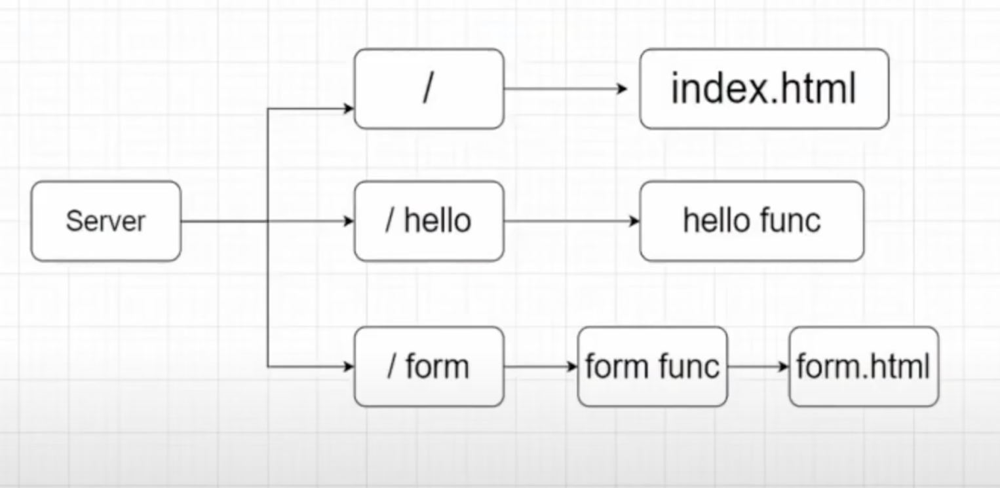

# Go Server
First app developed by me on go lang which is an small http request handler api
## Project idea from the top & Routes


## Steps
1. Building app
    ```
    go build
    ```
2. Running app
    ```
    go run main.go
    ```    
3. Now you are good to go, it will be listenning on port 8080
    ```
    👍
    ```


## Author
Sufiyan
